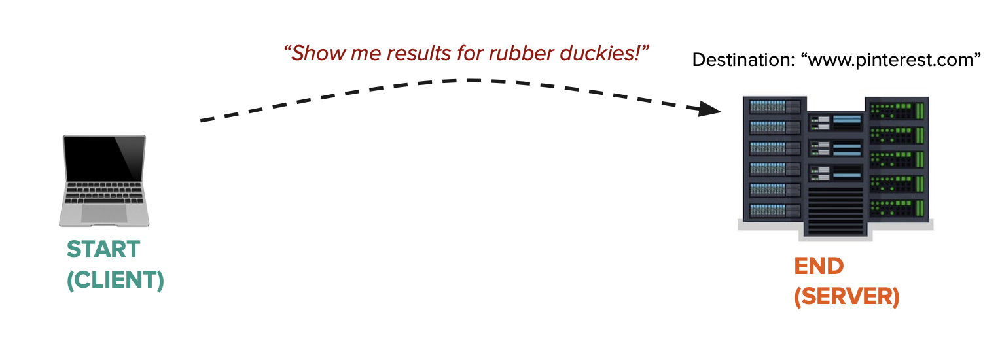
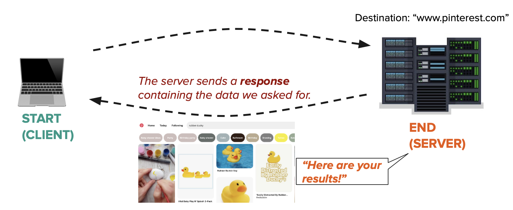

# Introduction to the Request/Response Cycle

ACS 1710 - Module 1: Lesson 1 

## Learning Outcomes 💫

By the end of this lesson, you should be able to...

- Explain how websites use the Request-Response Cycle to receive user input and show content to the user
- Identify the "request" and the "response" for a given web page

## Videos 🎥

https://youtu.be/2CYu4d0-YJk

## Exercises 💪

Answer “Request Response Questions” on Gradescope. 

Questions coming soon!

## Written Companion 🗒

How do devices on the internet communicate with each other and how can we build applications that use that same pattern?

Before we look at online communication, let's consider how traditional mail delivery works. For this example we can assume that a buyer would like to purchase something from a mail order catalogue:

1. The buyer fills out a physical form with the details of the items they'd like to purchase and includes a check for the required amount (made out to the seller)
2. The buyer places the form and the checks in an envelope, then mails it out to the address of the seller (this gets delivered to the seller by a mail courier such as UPS)
3. The seller receives the envelope from the mail delivery service. They open up the envelope, checks what items the buyer would like to purchase and if the given money covers the purchase, and puts all the items in a box to be sent back.
4. The seller sends the box via the same mail courier and the buyer gets their items.

Online communications follow this same pattern! We call the machine starting the communication (i.e. the buyer in the above example) the client and the machine that replies to the communication (i.e. the seller from above) as the server.

Clients always start the communication by creating a request and sending it to the server.

Clients can discover servers by their destination URL address in the same way that physical mail gets sent to a physical destination address (such as 555 Post Street, San Francisco, CA). We refer to this destination URL address as a route.

Notice in Fig 1.1 that the client sends a request to the server via the server's route: www.pinterest.com.

The server always ends the communication by creating a response and returning it to the client.

Once the client receives the response from the server—communication ends and the client must make a new request to for further interactions. Every communication will follow this loop!

Regardless of what the request by the client contains (for example, it could be a request to store an image) the server must always return a response! Even if that response contains nothing more than a success/fail status code.

A **response** will often times be a numerical status code. Some common status codes include:

- 200 = OK - successful execution of the request
- 404 = Server not found
- 500 = Server failed to execute the request

