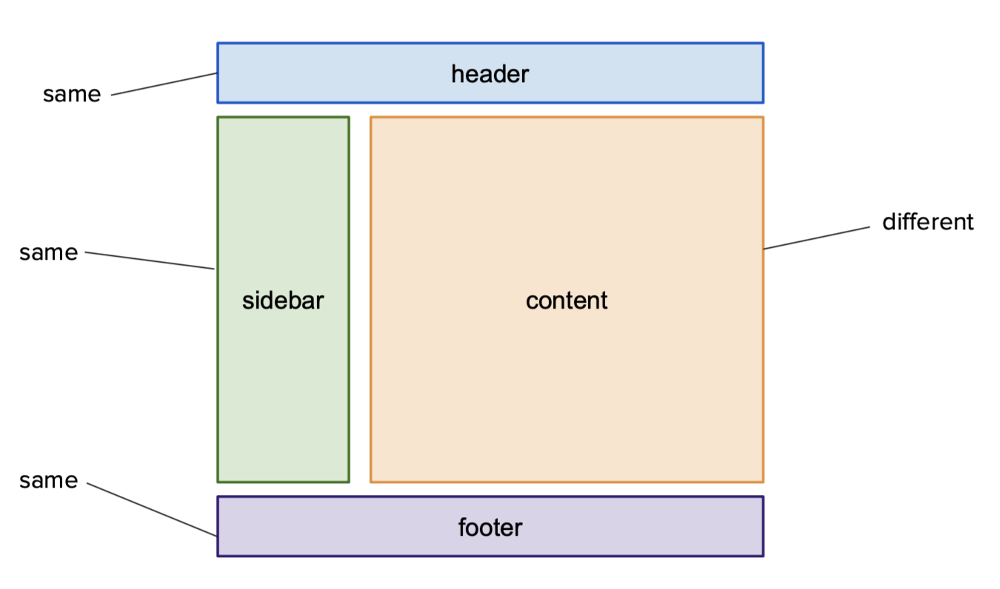

# Creating Reusable Components via Template Inheritance

## WEB 1.1 - Module 2: Lesson 5

# Learning Outcomes 💫

By the end of this lesson, you should be able to...

- Use Jinja2 `block` & `extends` tags to create reusable base templates.
- Explain how using a base template can help us to write D.R.Y code.

# Videos 🎥

Vid 1 - A walkthrough of using template inheritance to create reusable components across a website 

https://youtu.be/H0als3BogTs

# Exercises 💪

Complete the challenge in [this repl.it](https://repl.it/team/WebArchitecture/Module-204JinjaInheritance) and submit your work.

# Written Companion 🗒

<aside>
🤔 Most website will use the same header, footer, etc. through it! How can we design a website that has reusable pieces throughout it, and how can we leverage templates to reduce the amount of repeated code?

</aside>

---

Websites often times have reusable content that gets rendered on many pages such as a header, sidebar, or footer. 



Fig 1 - a common design pattern that websites use (the same header, sidebar, and footer but changing content)

In design patterns such as this, the only component that changes would be the content. 

<aside>
💡 Let's make reusable components inheirtable in templates so that we only have to create them once and allow unique content to be passed in!

</aside>

A reusable template component can be marked using the `% block blockName %` tag. Note that `block` operates as a keyword and `blockName` can be any reference name.

Similar to the conditional and loop tags in Jinja2—each `` needs to be closed with an ``.

```html
<! -- filename = templates/base.html -- >
<! -- a standard HTML boilerplate with two template % blocks % -- >
<!DOCTYPE html>
<html>
   <head>
       <title>
           
       </title>
   </head>
   <body>
       <header>
           ...
       </header>

       <main>
            PLACEHOLDER TEXT 
       </main>

       <footer>
           ...
       </footer>
   </body>
</html>
```

*Fig 1 - A file named `templates/base.html` that uses a pair of `` templates named `title` and `content` being implemented into standard HTML boilerplate*

- *Note: the `content` block has `innerHTML` being utilized just like a normal HTML tag!*

Once a template has been created with blocks, other templates can inherit them using the `` syntax.

```html
<! -- filename = templates/index.html -- >
<! -- a template that utilizes the title and content blocks defined in Fig 1 -- >



   My Pizza Delivery App



   Welcome! Here is the place where you order pizza.

```

*Fig 2 — A file named `templates/index.html` that uses all of the content defined in `templates/base.html`, with the blocks `title` and `content` populated with unique content.*