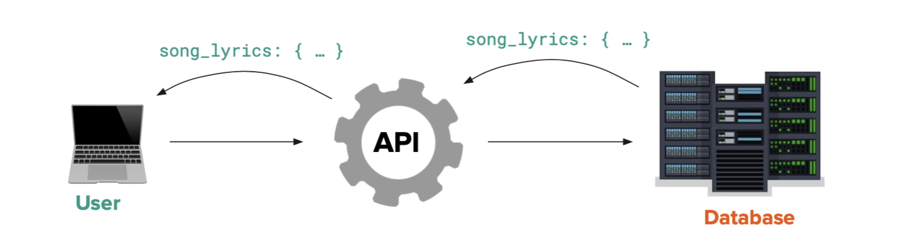

# Using the Requests Library to Generate User Requests

## WEB 1.1 - Module 3: Lesson 5

# Learning Outcomes 💫

By the end of this lesson, you should be able to...

- Use the Python `requests` library to make simple API requests and display the response.
- Create Flask routes which make API calls and show the user a response.

# Videos 🎥

[Vid 1 - walking through how to create requests via the `Requests` Python library](https://youtu.be/sJOmt33lq4E)

Vid 1 - walking through how to create requests via the `Requests` Python library

# Exercises 💪

1. Complete the exercises in [this repl.it](https://repl.it/team/WebArchitecture/Module-303ApiPractice) (only API, no Flask) and submit your work.
2. Complete the exercises in [this repl.it](https://replit.com/team/WebArchitecture/Module-304ApiFlaskPractice) (API and Flask) and submit your work.

# Written Companion 🗒

<aside>
🤔 We can use tools like Postman to quickly make requests for API testing, but how do we create a request in Python?

</aside>

---

When developing in a Python environement, the `Requests` library can be used to create requests. The `Requests` library provides us with the following tools:

- `requests.get(routeURL, params)` = the `Requests` method used to create a `GET` request
    - `routeURL` = a string with the route URL information required to find the desired server
    - `params` = an object of **key-value** pairs that contains the query parameters of the search.

The results of a `requests.get()` method includes information such as the header, packet data, and payload. Typically, an application only needs the payload data (most commonly a `JSON` object) so developers will usually use the `.json()` method on the results to seperate the valuable information from the junk.

```python
import requests

# an object containing all the key-value pairs relevant to the query
params = { "limitTo": "nerdy" } 

# result contains the respone recieved from the requests.get() method
result = requests.get(
    "http://api.icndb.com/jokes/random", 
    params=params) 

# strip the JSON data from the results for easier access
joke_json = result.json() 
```

*Fig 1 - a standard request using the requests library to the `[api.icndb.com/jokes/random](http://api.icndb.com/jokes/random)` API.*

<aside>
🚨 Although less common, a payload may contain data in a raw `.txt` format instead of a `json` object! To work with a `.txt` payload—use `result.text` (notice that `text` intentionally does not have parentheses).

</aside>

---

### Implementing a request into a Flask route

<aside>
💡 Requests can be combined with Flask routes for a variety of results!

</aside>

<aside>
🤔 What happens when we take the results of a `request.get()` query and return it as the output of a Flask route?

</aside>

```python
# the same request snippet from above combined with Flask
import requests
from flask import Flask

app = Flask(__name__)

@app.route('/joke')
def make_joke():
    params = { "limitTo": "nerdy" }
    result = requests.get( 
        "http://api.icndb.com/jokes/random", 
				params=params)
    joke_json = result.json() 

		# users want the contents of the JSON object,
		# not the JSON object itself
    return joke_json["value"]["joke"]
```

*Fig 2 - Returning the `JSON` contents of the joke to the user when they request information from the `/joke` Flask route*

- *Note: the `/joke` itself route creates a request and recieves a response, then cleans up that data and returns it as a response to the user that queried `/joke`*

<aside>
💡 Combining requests with Flask routes creates an intermediary step for users! They request information from the Flask route, the Flask route requests data from another service and cleans it up, then returns that data as another response.

</aside>



Fig 3 - An image representing how intermediary steps get leveraged