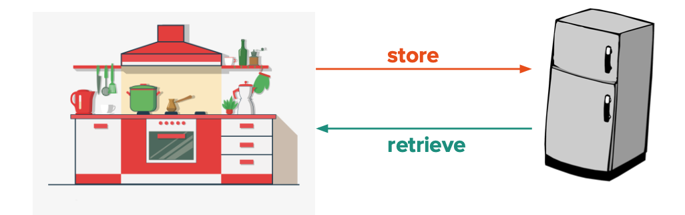

# Introduction to Databases

## 1710 - Module 5: Lesson 1

# Learning Outcomes 💫

By the end of this lesson, you should be able to...

- Explain why a database is useful to a large-scale application.

# Video Companions 🎥

[Video 1 - Introducing databases technologies and how they fit into an application](https://youtu.be/2K8eT3VfnuA)

Video 1 - Introducing databases technologies and how they fit into an application

# Exercises 💪

Answer the questions in the `README` file in [this Repl.it](https://repl.it/team/WebArchitecture/Module-51Introduction-to-Databases) and submit your work.

# Written Companion 🗒

<aside>
🤔 How do we store massive amounts of data in an organized fashion that can also be accessed/modified quickly?

</aside>

---

A technology designed to hold data can be defined as a **database.** Key features of a database include:

- it being a place to store data (i.e. user profiles, website usage, business transactions, etc.)
- typically stores data using **key-value** pairs that exists seperate from a web server
- multiple applications can access its data simultaneously
- stored data can be queried and analyzed efficiently
- data remains stable and non-volatile (aka values don't change in a power outage or application crash)

<aside>
💡 Separating databases from web servers allows each to perform a more specialized function! It also ensures that databases can better serve multiple destinations.

</aside>

A database has many uses, but some of the most commonly use cases include:

- being a location that user data can be easily referenced from
- simple storage
- identifying and understanding the relationships between data

A good analogy for the role a database plays in an application would be what fridges do for a kitchen. A fridge keeps food in a usable state that can be easily accessed!

*Fig 1 - we store food and retrieve food from a fridge in the same fashion we store and retrieve data in a database!*