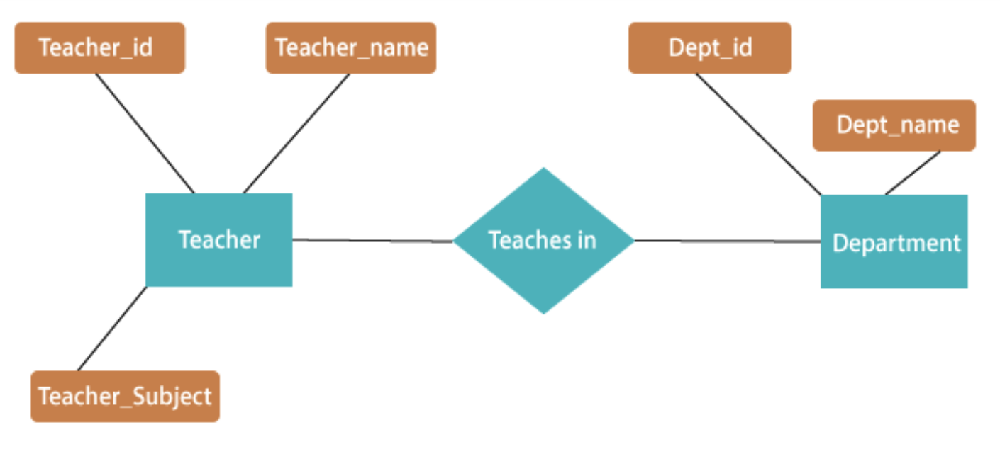

# SQL vs NoSQL and Introduction to MongoDB

## ACS 1710 - Module 3: Lesson 2

# Learning Outcomes 💫

By the end of this lesson, you should be able to...

- Conceptually create a data query
- Identify relationships in data
- Explain the trade-offs between a SQL and NoSQL database
- Utilize MongoDB and the `ObjectId`

# Video Companions 🎥

[Video 1 - Exploring the differences and use cases of SQL vs NoSQL](https://youtu.be/38ebgY7QKt8)

Video 1 - Exploring the differences and use cases of SQL vs NoSQL

# Exercises 💪

Answer the questions in the `README` file in [this Repl.it](https://repl.it/team/WebArchitecture/Module-52SQL-vs-NoSQL) and submit your work.

# Written Companion 🗒

<aside>
🤔 What would be a good first database technology to implement?

</aside>

---

Many database technologies exist, and each database has its own set of professional trade-offs. 

A developer interacts with data in a database by making a **query.** These queries can be formed in many ways, with each database language approaching it in a different method.

Data can also have **relationships**. For example, if a database contains information about musicians and songs, a **relationship** property might exist between the musicians and songs called "composer". Relationships can exist between many types of data, such as teachers and school departments!



*Fig 1 - a relationship diagram representing the relationship between teachers (with an ID, name, and subject to teach) and departments (with an ID and name).*

<aside>
🚨 Always consider if the database technology employs a relational centric **structured query language (SQL)** or a non-relational centric **"not only" structured query language (noSQL)—**as this will form the basis of the data's structure and potential tradeoffs of the technology.

</aside>

### SQL vs NoSQL Tradeoffs

An SQL database works best for highly-connected relational data (stored in **tables**) that requires quick queries and scales by moving the central data storage to a more powerful machine (aka vertically scaling). 

A NoSQL database works best for lightly-connected, non-relational data (stored in individual key-value pairs called **documents)** that requires dynamic or unstructured data queries and scales by adding additional virtual machines/databases to the system (aka horizontal scaling). 

<aside>
💡 In this class we will be using low-complexity, lightly connected data so a noSQL database would be the best choice.

</aside>

### Introduction to MongoDB

MongoDB uses the document-based noSQL approach and a simple query language—making it a great starting technology. It also stores data using **key-value** pairs!

Each **key-value** pair gets referred to as a **document,** and a series of similar documents would be stored together in a **collection.**

```python
# four song document objects in a MongoDB collection called `songs`
{
    'name': 'Can\’t Buy Me Love',
    'artistId': ObjectId('12345'),
    'avgRating': 4.7
},
{
    'name': 'Teardrops on My Guitar',
    'artistId': ObjectId('12342'),
    'avgRating': 4.7
},
{
    'name': 'Single Ladies',
    'artistId': ObjectId('12347'),
    'avgRating': 4.7
},
{
    'name': 'Roar',
    'artistId': ObjectId('12343'),
    'avgRating': 4.7
}
```

*Fig 2 - four **document** objects, each with three **key-value** attributes, contained in a single MongoDB **collection called `songs`***

In MongoDB, the container which stores all the **collections** in a single project would be called the **database.**

> individual document objects go in => collections, which grouped together go in => database
> 

### The `ObjectId`

Every document has its own unique `ObjectId` property. This ensures that every document has a primary identifier for query operations. All new documents in MongoDB get a `ObjectId` assigned them during creation. If an `ObjectId` does not get assigned directly by the developer—MongoDB will create a random one for the document.

A document's `ObjectId` gets stored as a **value** with a **key** of `'_id'`.

<aside>
🚨 An `ObjectId` does not use a string value. Instead, it uses the built in MongoDB BSON object method `ObjectId`. Always keep this in mind when creating an `ObjectId` as assigning the `'_id'` property of a document anything but this `ObjectId` will result in an error!

</aside>

```python
# creating a new document with a specified _id:ObjectId pair
{
   'first_name': 'Jay',
   'role': 'instructor',
   'teaches': 'WEB 1.1',
	 '_id': ObjectId('5f5f871c9bca94a49d6e8956')
}

# having MongoDB automatically generate a random default ObjectId
}
   'first_name': 'Meredith',
   'role': 'instructor',
   'teaches': 'WEB 1.1'
}

```

The `BSON` object is MongoDB's unique data structure for managing documents and operates almost identically to the `JSON` object. 

<aside>
💡 In the context of this course, all we need to know about the `BSON` object is that MongoDB uses it and operates similarly to the `JSON` object. We will be mainly using to create `ObjectId`'s as needed.

</aside>